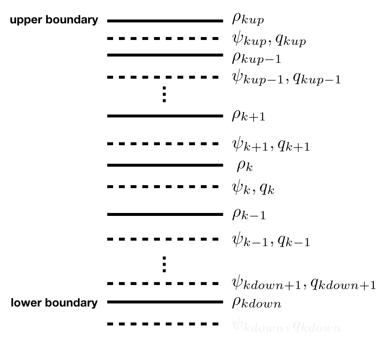

Equations of motions, grids
===========================

Continuous form
---------------

Key state variables are the geostrophic streamfunction and potential vorticity which are related
according to:

.. math::

   q(x,y,z) = f-f_0 + \Delta \psi + \partial_z \Big ( \frac{f_0^2}{N^2} \partial_z \psi \Big ) = 0 

where f0 is the averaged Coriolis parameter and N(z) is the buoyancy frequency.

Density anomalies and geostrophic currents are related to the streamfunction according to:

.. math::

   \partial_z \psi &= - \frac{g\rho}{\rho_0 f_0} \\
   (u,v) &= (-\partial_y \psi, \partial_x \psi)

The evolution of the system is governed by the advection of potential vorticity and top and bottom densities
by geostrophic currents:

.. math::

   \partial_t q + J(\psi,q) + J(\Psi,q) + J(\psi,Q) &= 0 \\
   \partial_t \partial_z \psi + J(\psi,\partial_z \psi) + J(\Psi,\partial_z \psi) + J(\psi,\partial_z \Psi) &= 0

Vertical grid
-------------

